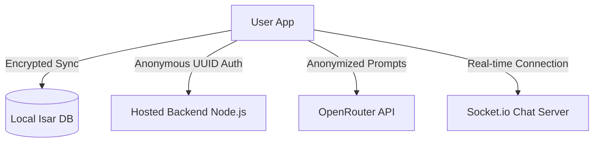
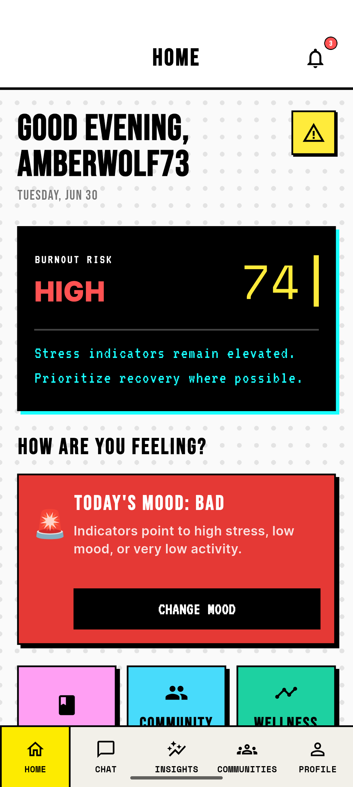
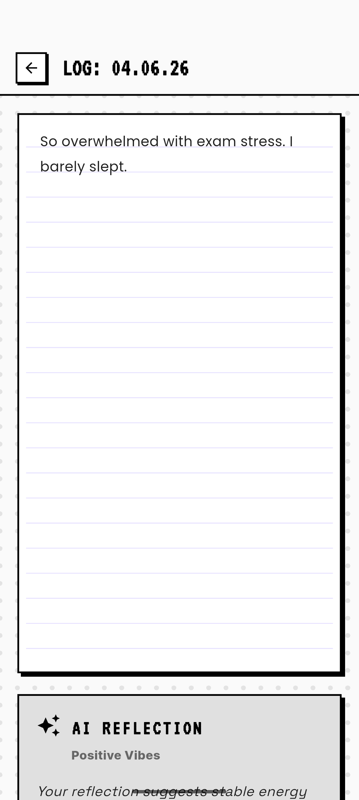
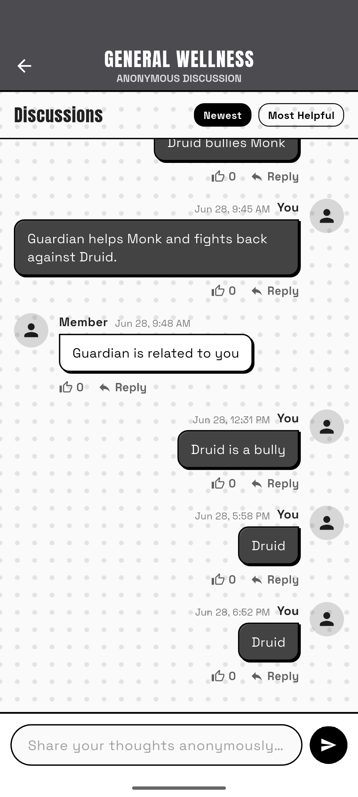

#  MindMate

> **MINDMATE // NO PRETENDING, NO DATA MINING.**  
> A privacy-first, secure, and resilient mental wellness companion. MindMate empowers users to track their thoughts, engage in safe community chats, and interact with AI-driven insights, all while ensuring complete data privacy and security.

## 🌟 Key Features

*   **Absolute Privacy & Security**: No personal data mining. Authentication relies on UUIDs, recovery phrases, and short-lived OTPs.
*   **AI-Powered Companion**: Integrated with OpenRouter API to provide contextual and empathetic mental wellness insights.
*   **Voice & Text Journaling**: Seamlessly log your thoughts using robust speech-to-text and text-to-speech capabilities.
*   **Local & Secure Storage**: Journals and sensitive data are kept locally encrypted via Isar Database and Flutter Secure Storage.
*   **Community Chat**: Safe, real-time community engagement powered by Socket.io.
*   **Crisis Help Integration**: Immediate, 24/7 assistance protocols built directly into the core app experience.
*   **On-Device Machine Learning**: Utilizes ONNX Runtime for local AI inferences.

---

## 🧠 How It Works

MindMate is designed as a secure, decentralized workspace for your mental health. Here is how the key components work together:

### 1. Anonymous Authentication & Storage
*   No names, emails, or personal information are required to create an account. Instead, the app generates a unique **UUID** and key phrase on-device.
*   Data is written to an on-device **Isar Database** and encrypted using keys stored in the platform's secure hardware enclave (Keystore/Keychain) via **Flutter Secure Storage**.

### 2. Private AI Journaling
*   When journaling, your prompts are analyzed using ONNX models locally or sent anonymously via the hosted backend to the **OpenRouter API**.
*   The communication is fully decoupled from any identifiable personal information, keeping your entries completely private.

### 3. Protected Community Hub
*   Chat channels are powered by **Socket.io** for real-time interaction.
*   The backend enforces strict rate limiting and filtering to maintain a safe environment for all participants.

---

## 🛡️ Core Pillars

### 🔒 Zero Data Mining
Every feature in MindMate is built with user privacy as the starting constraint. We do not track, catalog, or monetize any journaling entry, chat message, or user behavior.

### 🤝 Companion Care
The AI companion acts as an empathetic sounding board, designed to help guide you through stressful situations, suggest cognitive exercises, or help organize thoughts.

### ⚡ Resiliency
Even in low-connectivity or high-stress situations, the application retains full local functionality (local journaling, local security protocols) and quick access to crisis help resources.

---

## 🔒 Privacy Protocol

MindMate architecture is built for resilience. This is the first and last time we see your data. We adhere to a strict **Zero Data Mining** policy. Your identity verification and journal data are secured with end-to-end encryption methodologies.

---

## 📸 Screenshots

| Home Dashboard | Journaling Experience | Community Chat |
| :---: | :---: | :---: |
|  |  |  |

---

## 🛠 Tech Stack

### Frontend (Mobile)
*   **Framework**: Flutter (Dart)
*   **Local Database**: Isar DB
*   **State Management**: Provider
*   **ML/AI**: ONNX Runtime
*   **Media**: Speech to Text, Flutter TTS, Image Picker
*   **Security**: Flutter Secure Storage, Encrypt

### Backend (Server)
*   **Runtime**: Node.js
*   **Framework**: Express.js
*   **Database**: MongoDB Atlas (Mongoose)
*   **Real-time Communication**: Socket.io
*   **AI Integration**: OpenRouter API
*   **Email Services**: Brevo API (for Secure OTPs)
*   **Security**: JWT, bcryptjs, express-rate-limit

---

## 🚀 Getting Started

To install and use the app, download the ready-to-run release build:
1. Go to the **Releases** section on GitHub.
2. Download the latest `.apk` file.
3. Install the APK on your Android device.

*Note: The production backend is hosted online and pre-configured. No local server setup is required to run the application.*

---

## 📜 License
*MindMate Architecture. Built for Resilience. All Rights Reserved.*